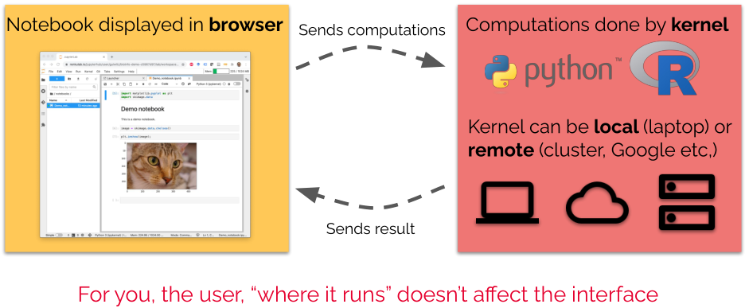
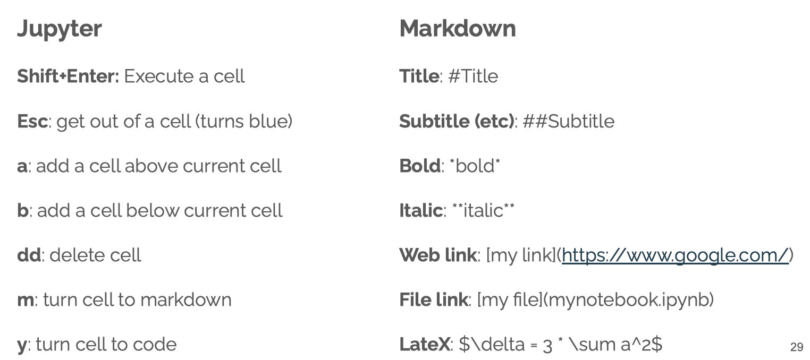
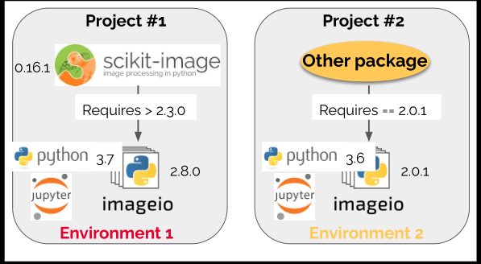
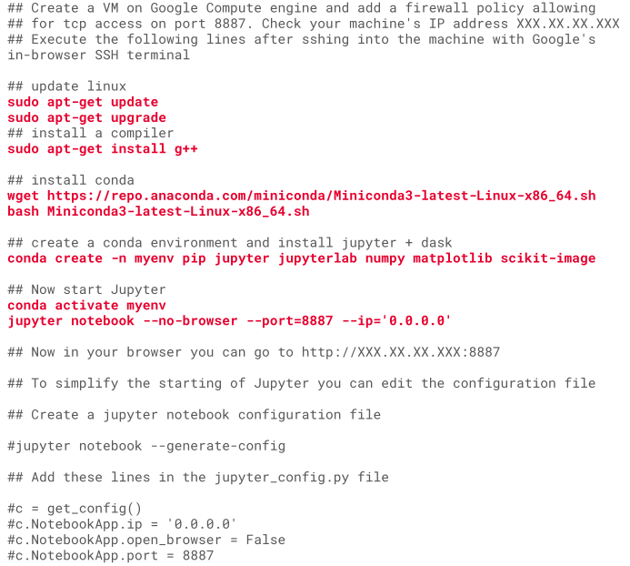

```{r setup, include=FALSE}
knitr::opts_chunk$set(echo = TRUE)
```

## Introduction

Jupyter notebooks are interactive computing documents especially popular in data intensive fields (data science).

By their nature they are a great tool for:

  - Easy **design** of analysis workflows
  - **Documenting** code / workflows and increasing their reproducibility
  - Exploiting **cloud computing** resources 

## Used in academic research and in companies

Bloomberg, PANGEO is the first and foremost a community promoting open, reproductible and scalable science.


## Course content

1. Interactive computing - Jupyter
2. Resources - Run jupyter on HPC/cloud
3. Publish - Github and Zenodo to publish code
4. Reproducible code - Renku/Binder

## Why reproducible code?

### Levels of reproducibility: minimal
Computations only described. Maybe possible to reconstruct at great pain.

Impossible to verify.

### Levels of reproducibility: upon request
Computations only described.

In principle possible to reconstruct.
  
  - The Science Journal policy (must be available)
  - Answers one gets from authors (not prefer sharing)
  
### Levels of reproducibility: complete code
Possible to reconstruct.

Impossible to reproduce exactly (e.g. package versions missing)

### Levels of reproducibility: reproducible code
Possible to reproduce exactly (via container technology)

### The future: eLife example

## Jupyter Notebooks

### Interactive computing with Jupyter
  - Write and execute code
  - Display images and plots
  - Document every step with formatted text (Markdwon)
  - Excute code step by step
  - Call other software from notebooks (e.g. ilastik)
  
### What is a Jupyter notebook?

A **text** file (easily sent around) Rendered by Jupyter in the **browser** Split into sections called **cells**

Cells can contain:
  - Code
  - Formatted text
  - Rich output
  
### How and where does a notebook compute


Right side kernel could be **binder**, **Colab**, **Renku**

### Renku notebook

#### Notebook cells
  - Code broken into chunks: cells
  - Variables defined for whole notebook
  - Only the order of cell excution matters
  - **Good practive: Top-down order**
  - The cell type can be switched from Code to Text(Markdown)
  - Possible to run all cells are part of a notebook
  - **Toolbar** can be used to:
    - Copy/paste cells
    - Add new cells
    - Run a cell or stop execution
    - Change cell type from code to markdown
    - More options in menus

#### Notebook handling
Right-click on notebook in panel to: Rename, Download, Shut down, Copy, Duplicate, etc.

#### The notebook kernel
Notebook content does not depend on kernel.

Variables conserved as long as kernel is ON (green dot).

Kernel can be restarted.

  - Interrupt long calculation
  - Re-initialize variables 
  
**Good practice: periodically restart kernel to avoid “*strange*”  states**
  
### Jupyter cheat sheet
{width=70%}

#### Mixing languages in Jupyter: command line

  - Exclamation mark: `!pwd`
  - Use "magic" commands: 
  
    ```{}
    %%bash
    cd myfolder
    ls
    ```
    
#### Beyond notebooks

  - Interactive features with ipywidgets:
  - Creating interactive web-apps with voilà:
  - Create interactive online books with Jupyter:
  - Running a multi-user Jupyter with JupyterHub (e.g. The Littlest JupyterHub)
  
#### Other public Jupyter resources

  - With switch-AAI login (same as Ilias login): EPFL: https://noto.epfl.ch/ Jupyter running on EPFL servers, fully customizable environments With switch-edu or GitHub:
  - Swiss Data Science Center: https://renkulab.io/ Powerful combination of Jupyter, GitHub and data repository 
  - With Kaggle (ML competition site): https://www.kaggle.com/
  - Access to interesting datasets, GPU etc.
  
### Run Jupyter locally: Docker
There are images to run Jupyter e.g.

- To install: `docker pull jupyter/datascience-notebook`
- Or directly install and run: 
  ```
  docker run -p 8885:8888 
  jupyter/datascience-notebook
  ```
- Browse to http://localhost:8885/lab
- Alternatively, after: `docker pull jupyter/datascience-noteboo` run from Docker Desktop and set the port to 8885. Open a command line, and recover token with: `jupyter notebook list` Browse to http://localhost:8885/lab

### How do I install Jupyter?
Easiest solution is conda based:
* Install Anaconda: access Jupyter via simple click in a user interface
* Install miniconda and start from command line with: jupyter lab
* Both install a minimal set of tools (Jupyter, Numpy etc.)

### Installations: why environments?

  - Why not simply open a terminal and run e.g. pip to install all necessary packages?
We can enclose each project into an **environment** !
  - Each environment contains all necessary tools, including python 
  - With conda, dependencies are “resolved” by conda
  
  
  
### Jupyter on cluster

We recommend installing all necessary components via conda:

1. You can load conda as a module: `module load Conda/miniconda/latest`
2. You can make it easy to use conda by typing: `conda init`
3. Exit the ssh session (e.g. type exit) and ssh-login again. You should see (base) now at the start of the line.
3. Create an environment in which you install jupyter (and matplotlib for demo): `conda create -n myenv jupyterlab matplotlib`
And wait…

In principle to run Jupyter, you now need to 1) activate the environment and 2) run
Jupyter:

  ```
  conda activate myenv
  jupyter lab
  ```
However:

1. You now need to access Jupyter via ssh and not over regular web
2. You need to run Jupyter within a SLURM Job, and not on the login node

#### Jupyter on cluster: ssh tunneling
1. Start jupyter like this:
`jupyter lab --no-browser --ip=0.0.0.0 --port=8889`
2. Tunnel Jupyter from the cluster port 8889 to you local port 8889:
`ssh -N -f -L 8889:binfservms01:8889 your_username@binfservms01.unibe.ch`
3. Open your local browser and go to: `localhost:8889`
4. Enter the token that appeared in the first terminal

#### Jupyter on cluster: interactive jobs

1. Use srun to start an interactive job as a bash shell:
`srun --mem-per-cpu=1G --cpus-per-task=1 --time=01:00:00 --pty bash`

  - You should see that your node has changed e.g. to binfservas01
2. Activate your environment and start jupyter:
  
  ```
  conda activate myenv
  jupyter lab --no-browser --ip=0.0.0.0 --port=8889
  ```

3. Establish again an SSH tunnel but change the compute node!
`ssh -N -f -L 8889:binfservas01:8889 your_username@binfservms01.unibe.ch`

### Jupyter in the cloud: Google Colab 

Google’s version of Jupyter

  - Same basic principles, different layout
  - Kernels run on Google infrastructure for free
  - GPUs available
  - Opens any notebook on Github
  - R is still experimental, create notebook with https://colab.research.google.com/notebook#create=true&language=r

#### Colab sessions
  - Sessions time-out after max 12h
  - Data accessible through Google Drive
  - Common packages pre-installed
  - Additional packages need to be installed in each notebook

#### Upload your notebook to Colab

If you have a Google Account, you can use the service for free. Go here: https://colab.research.google.com Choose Upload. Try to run your notebook.


#### Example of Colab usage
  - **kallisto | bustools** is a workflow for pre-processing single-cell RNA-seq data:
  - **ZeroCostDL4Mic** Simplifying usage of deep learning for image processing in biology, Usage of Colab specific features like forms

### Jupyter in the “real” cloud: Google Compute Engine
  - Same type of offers from *Google Cloud Compute, Amazon EC2, Microsoft Azure, Digital Ocean*
  - For Swiss academics, use **Switch Engines**
  - Access to “unlimited” resources
  - No queuing
  - Not free, potentially very expensive (GPU)

#### Jupyter on Google Compute Engine
Simple example script to run on a VM to set-up Jupyter and a few packages and access to it in your browser.

{width=80%}

## Code repository and management: GitHub
### Sharing notebooks: GitHub
- GitHub is a repository for code based on git, a software to keep track of changes in software 
- Projects are “folders” called a repositories 
- Public repositories are browsable: https://github.com/guiwitz/hpc_cloud - GitHub is **many** more things than just a repository

### Much more with GitHub

- Fork (“copy”) other people’s repositories
- Create software releases
- __GitHub Actions__: Automatically execute workflows on a repository upon events like a push. E.g. run tests on multiple OS’s (see e.g. https://github.com/guiwitz/hpc_cloud)
- __GitHub Pages__: Automatically generate a static website e.g. for documentation. 

## Sharing files: from static to dynamic
### Sharing notebooks statically
- Notebooks are rendered **statically** on GitHub
- **Nbviewer** offers a more reliable rendering

### MyBinder
### Making notebooks interactive with binder

- Creates a remote Jupyter instance and copies Github repository
- Opens Jupyter in the browser and **works exactly like a local Jupyter**
- Add a repository address e.g. https://github.com/guiwitz/hpc_cloud
- Use a specific commit / branch
- Copy the text for the markdown badge

#### MyBinder badge
To add a badge, copy the Markdown link (previous slide). Something like:

```
[](https://mybinder.org/v2/gh/guiwitz/hpc_cloud/main)
```

Add it to your `README.md` file (edit, copy/paste link, commit change).

#### MyBinder sessions
- Short sessions: stop after a few minutes inactivity
- Download your modified notebook OR Save/load it to/from browser storage
- Does not work with “external” software (e.g. external interactive windows)

## Making notebooks interactive with Colab
Add a Badge like for binder. We can add to our README.md something like this:
```
[](https://colab.
research.google.com/github/guiwitz/hpc_cloud/blob/main/Demo_notebook.ipynb)
```

## Notebooks on Renku

Renku combines container, notebook and repository technology

1. Choose environment: Jupyter, RStudio, packages etc.
2. All settings and files are kept and updated in a repository
3. A Docker image for that environment is created and updates at every change
4. The image can be run on Swiss Data Science Center infrastructure

## Preserve and cite: Zenode
### A repository for multiple data types
- Reports that are not published but should be citable
- Datasets, often related to an article
- Software either “professional” or custom script e.g. accompanying an
article

### What Zenodo offers
- Security: GitHub can suspend your account without notice. Zenodo is publicly funded and guarantees your “artefacts” are available
- “Zenodo does not impose any requirements on format, size, access restrictions or licence”
- Upload data over time and add an embargo e.g. until a publication
- Offers a DOI, digital object identifier, a unique id that can be used to reference a software, dataset etc. E.g. https://doi.org/10.7554/eLife.49305

### Connecting GitHub and Zenodo
To avoid adding “test-repositories” to Zenodo, we use today the Zenodo Sandbox. It’s identical to Zenodo but it’s content can be purged.
Some functionalities are only “for show” and do not work normally.

### Connecting GitHub and Zenodo
#### Select Repositories to “synchronize”
- Select repositories to synchronize
- Upon creating a release, Zeonod copies the repository and assigns a DOI
- You can add a badge to the repository to show how to reference it

#### Create a GitHub release

#### Get DOI and add badge

#### Using GitHub+Zenodo+DOI in real life

#### Coming full circle: Mybinder + Zenodo DOI

Use the Zenodo DOI to start an interactive session directly on MyBinder!
The Sandbox DOI does not work. To test this use e.g.: https://zenodo.org/r
ecord/3240495#.X5NLFUL7Tlw
