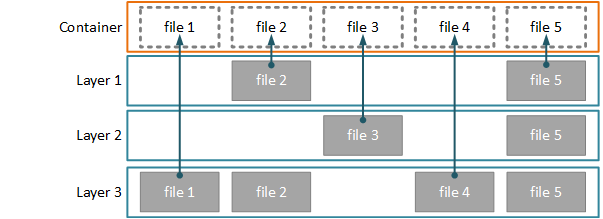
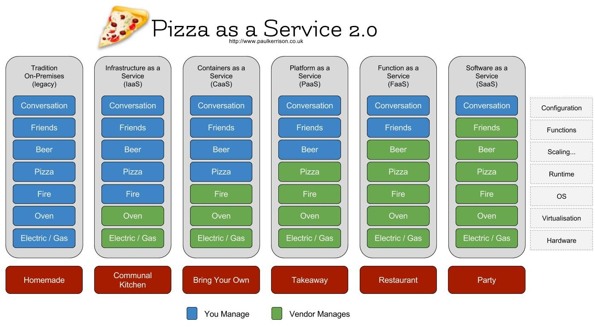

- Containers
  1. The problem we're solving
  2. VMs vs Containers
  3. Docker: theory
  4. Docker: practice
  5. Composition and orchestration
  6. Singularity (vs Docker)
- Cloud
  1. What is "The Cloud"?
  2. Something as a Service
  3. Cloud pricing
  4. Cloud considerations
  5.Public cloud examples
  6. IaaS in practice
  
## Containers - What do they solve?

### Problem (for developers, part 1)

Suppose you're writing some software. To do that, you need the tooling for your language of choice (compiler / interpreter), language-specific libraries with development versions, and native system libraries.

You may need extra things depending on your project, such as a web server stack, a database, etc.

If you're lucky, it's easy to install at least some versions of all that on your OS, and get your development project going.

If you aren't, there are complex actions required to install your stack; ones that you want to write down, or better yet - automate.


### Problem (for developers, part 2)

Okay, you got one project working. But now you want to work on two projects at once.

And those projects requires different software stacks, which are incompatible with each other.

Some programming languages offer solutions in terms of virtual environments or other project-specific ways to track dependencies, but this is only a partial solution.

<!-- What you would really want is a way to isolate all dependencies of your
  software. -->


### Problem (for developers, part 3)

Suppose have written some software.  

It works great on your machine.

However, eventually it has to leave your machine: has to run on your colleague's machine, or deployed in its production environment.

It can be a completely different flavour of OS, with a different set of libraries and supporting tools.

It can be difficult to test if you accounted for all those variations on your own development system.  You may have things in your environment you're not even aware of that make a difference.

Your users could also be less technically inclined to deal with dependencies. You may wish to decrease this friction.


### Problem (for users)

Suppose you want to run or deploy some piece of software.

First off, you really would like some sort of turn-key solution. Of course there's none, there's only the source code.

The build instuctions are outdated and the original developer is no longer available.

You also don't trust this software fully not to mess up your OS.

Or, you want to run it on a remote server for which you don't even have the privileges to comfortably install all the dependencies.


### Problem (for researchers)

Suppose you have a piece of scientific software you used to obtain some result.

Then someone half across the globe tries to reproduce it, and can't get it to run, or worse - is getting different
  results for the same inputs. What is to blame?

Or, even simpler: your group tries to use your software a couple of years after you left, and nobody can get it to work.

For a reproducible way to do science with the help of software, packaging just the source code might not be enough; the environment should also be predictable.


### Problem (for server/cluster administrators)

Suppose you have a hundred of users, each requesting certain software.

Some of it needs to be carefully built from scratch, as there are no prebuilt packages.

Some of the software works with mutually-incompatible library versions. Possibly even known-insecure ones.

Any such software change has to be injected in a scheduled maintenance window, but users want it yesterday.

And finally, you don't trust any of this software not to mess up your OS.


## What would be a solution?

* **A turnkey solution**

  A recipe that can build a working instance of your software, reliably and fast.

* **BYOE: Bring Your Own Environment**

  A way to capture the prerequisites and environment together with the software.

* **Mitigate security risks**

  Provide a measure of isolation between the software running on a system. No security is perfect, but some is better than none.


## Solution: Virtual Machines?

A virtual machine is an isolated instance of a **whole other "guest" OS** running under your "host" OS.

A **hypervisor** is responsible for handling the situations where this isolation causes issues for the guest.

From the point of view of the guest, it runs under its own, dedicated hardware. Hence, it's called **hardware-level virtualization**.

Most guest/host OS combinations can run: you can run Windows on Linux,
Linux on macOS, etc.


### Virtual Machines: the good parts

* **The BYOE principle is fully realized**
  
  Whatever your environment is, you can package it fully, OS and everything.

* **Security risks are truly minimized**

  Very narrow and secured bridge between the guest and the host means little (but not zero) opportunity for a bad actor to break out of isolation.

* **Easy to precisely measure out resources**

  The contained application, together with its OS, has restricted access to hardware: you measure out its disk, memory and alotted CPU.


### Virtual Machines: the not so good parts

* **Operational overhead**

  For every software packaged as a VM, the full underlying OS has to be run, and corresponding resources allocated.

* **Setup overhead**

  Starting and stopping a virtual machine is not very fast, and/or requires saving its state.

  Changing the allocated resources can be hard too.

* **Hardware availability**

  The isolation between the host and the guest can hinder access to specialized hardware on the host system.


## Solution: Containers (on Linux)?

If your software expects Linux, there's a more direct and lightweight way to reach similar goals.

Linux kernel allows to isolate processes from the rest of the system, presenting them with their own view of the system.

You can package entire other Linux distributions, and with the exception of the host kernel, all the environment can be different for a process.

From the point of view of the application, it's running on the same hardware as the host, hence containers are sometimes called **operating system level virtualization**.


### Containers: the good parts

* **Lower operational overhead**

  You don't need to run a whole second OS to run an application.

* **Lower startup overhead**

  Setup and teardown of a container is much less costly than booting and stopping a VM.

* **More hardware flexibility**

  You don't have to dedicate a set portion of memory to your VM well in advance, or contain your files in a fixed-size filesystem.

  Also, the level of isolation is up to you. You may present devices on the system directly to containers if needed.


### Containers: the not so good parts

* **Kernel compatibility**

  Kernel is shared between the host and the container, so there may be some incompatibilties.

* **Security concerns**

  The isolation is thinner than in VM case, and kernel of the host OS is directly exposed.

* **Linux on (technically) Linux**

  Containers are mostly a Linux technology. You need a Linux host (or a Linux VM) to run containers, and only Linux software can run.


### Containers on different OSes

#### Running Linux containers on other systems

Some container solutions (e.g. Docker) offer to run on host systems other than Linux.

It's important to know that this relies on a Linux VM as a "base" for the running containers, so it comes with VM problems.


#### Windows containers

Microsoft has recently embraced the idea of operating system level virtualization with [Windows Containers](https://docs.microsoft.com/en-us/virtualization/windowscontainers/about/).

The principles are the same (a process is presented a different environment but still runs under the same kernel).

<!-- ---

## History of containers

The idea of running an application in a different environment is not new to UNIX-like systems.

Perhaps the first effort in that direction is the `chroot` command and concept (1982): presenting applications with a different view of the filesystem (a different root directory `/`).

This minimal isolation was improved in in FreeBSD with `jail` (2000), separating other resources (processes, users) and restricting how applications can interact with each other and the kernel.

Linux developed facilities for isolating and controlling access to some processes with namespaces (2002) and cgroups (2007).

Those facilities led to creation of solutions for containerization, notably LXC (2008), Docker (2013) and Singularity (2016). -->


## Docker

* Docker came about in 2013 and since has become the golden standard for containerization technology.

* A huge amount of tools is built around Docker to build, run, orchestrate and integrate Docker containers.

  * Even tools that don't directly use Docker aim for compatibility with it.

* Many cloud service providers can directly integrate Docker containers. Docker claims X26 resource efficiency improvement at cloud scale.


### Docker architecture

Docker has a client-server architecture. Each system using Docker has to run a **Docker daemon**: a persistent, privileged service that can manage containers and other resources.

The daemon exposes an API that clients can use to control it. The classic example of a client is the `docker` command line utility.

Together, this server+client setup is called the **Docker Engine**.


Several Docker daemons can work together as a **cluster**, spreading workloads across several host machines.

Often, this is aided by **orchestration** tools that automate the process of coordinating container creation and further lifecycle.


### Docker Engine versions

Docker Engine comes in two editions:

* **Docker Enterprise Edition (EE)** is the paid version of Docker, with extensive official support, certifications, priority updates, long term support, extra features, and private image hosting. A "batteries included" version.

* **Docker Community Edition (CE)** is the open-source, free version of Docker provided directly by Docker that anyone can install on compatible systems, but has limited support. A "your own risk" version.


Your Linux distribution may have its own maintained version of Docker (based on the open-source version). This has no direct support for Docker, instead it's on your distro's maintainers to keep it up to date and solve issues.


### Docker Desktop

For Windows and MacOS, Docker provides a package called **Docker Desktop** that simplifies running Docker under those systems.

It's important to stress out that those packages run a base Linux system as a VM using one of the OS-appropriate methods as the base for running Docker.

On Windows, this requires either Hyper-V (compatible hardware + Pro version or higher) or WSL2 (requires recent Windows 10 version).

Also, Docker Desktop on Windows allows managing Windows containers (under Hyper-V).


### Dockerfiles, images and containers

A **Dockerfile** is a step by step recipe on how to build and run a container. It uses already-existing images, local and remote files to populate the container.


An **image** is a read-only template with instructions for creating a container instance. This includes the base filesystem for a container. An image is a result of executing instructions in a Dockerfile.

A **container** is a runnable instance of an image. A container can be created from an image, started (according to instructions in the image), stopped, attached to networks, have storage attached to it, etc.

#### Where do images come from?

Most of the images are built as further modifications to some base image. E.g. you would take a base Ubuntu image and add commands to install your software.

How to bootstrap an image from nothing is outside the scope of this course.

So, where do base images come from? Docker uses special servers called **registries** to store images, which will be downloaded as needed.

The central public registry is the [Docker Hub](https://hub.docker.com/), where anyone can put public images and has a freemium model for private images.

It's possible to deploy your own private registry servers.


### Docker: a diagram

{width="60%}

Source: [Docker overview](https://docs.docker.com/get-started/overview/)


## Using Docker - The hands-on part

### Installing Docker

This course assumes a Docker Engine CE installation on Linux or Docker Desktop installation on other platforms.

If you don't have it already installed, either:

* See [https://docs.docker.com/get-docker/](https://docs.docker.com/get-docker/) to download and install it (may need a reboot!)

* Use [https://labs.play-with-docker.com/](https://labs.play-with-docker.com/) to run the commands in an online sandbox (Docker ID login required)

* Just follow without exercises.

- **Note**: You need admin privileges on a system you want to install Docker on!


### Hello, Docker!

If Docker is properly installed, we should be able to run our first container.

```bash
$ docker run hello-world
```
  - You may need to use `sudo` on Linux!


If successful, this will give some technical output, then:

```
Hello from Docker!
This message shows that your installation appears to be working correctly.
```

Followed by an explanation of what just happened. Let's go over than in more detail.


### Aside: admin access?

Docker daemon runs with high privileges, and interacting with it requires similarly high privileges. By default, you need to be effective `root` (e.g. using `sudo`) to interact with it.

Docker installation normally creates a group `docker` which is authorized to run `docker` without access to normal `sudo`, hiding this fact.


However, it must be stressed: **Having access to the Docker daemon can allow privilege escalation to `root`**. So assigning the `docker` group to a user is as dangerous as allowing `sudo` and is mostly just a convenience.


### Hello, Docker! (in slo-mo, pt. 1)

Running the `docker` command runs a Docker **client** that talks to a locally running Docker daemon.

`docker run hello-world` is a command to create a new **container** using an **image** specified by `hello-world`.

Assuming a fresh install of Docker, no such image exists locally (in the images cached for the current user).

Therefore, Docker looks for the image in configured registries, which is Docker Hub by default.


#### Image name specification

Generally, images in a registry are organized by two components: a **name** and a **tag**:

```
name:tag
```

For Docker Hub, except for a few handpicked images, the name must be **namespaced** with the Docker user ID, e.g. `godlovedc/lolcow` means an image `lolcow` from user `godlovedc`.

Tags are a way to version multiple images of the same name.

Specifying a tag is optional: it defaults to a tag named `latest` (which does not have any special semantics, just a fixed name, like `master` in Git).

So `docker run hello-world` is looking for an image named `hello-world` and its tag `latest`.

### Hello, Docker! (in slo-mo, pt. 2)

Not finding an image `hello-world:latest` in the local cache, Docker contacts the registry at Docker Hub for it, and finds this:

[https://hub.docker.com/_/hello-world](https://hub.docker.com/_/hello-world)

It downloads some objects (layers, more on that later) from Dockerhub, after which the local image repository has the image `hello-world:latest`


Verify this with `docker image ls` to list available images.


### Hello, Docker! (in slo-mo, pt. 3)

Now that the image `hello-world:latest` is available, `docker run` creates a fresh **container** based on it.

It then runs the specified default executable within that container.

By default, `docker run` runs the container **attached**: the output of the program will be piped to the standard output of the shell.

Therefore, you're seeing the output of that program. After the program terminates, the container stops, and you're back at the shell.

- **Note**: The exact specifics of attachment can be configured; for example, for interactive programs one can use `-it` flags to attach input and pseudo-TTY.


### New container every time?

If `docker run` creates a new container, what happens to that container after it's done?

If we try to run `docker container ls`, it will show nothing. But in fact, by default it only shows running containers.


  - Run `docker run hello-world` a few more times, then examine the full container list with `docker container ls -a`


How to clean up this mess?

### Cleanup after `run`

Containers (and images) can be deleted with a corresponding `rm` command, e.g. `docker image rm hello-world`


  - Try to remove the `hello-world` image. Why did it fail?

  - Try to remove a container. What kind of name does it expect?


Besides `rm`, you can use `prune` to delete all unused images and stopped containers, respectively.

See https://docs.docker.com/config/pruning/

  - **Note**: `docker run --rm` will delete the container (but not the image) automatically after a container stops.


### Interactive container

Let's try running an Ubuntu container interactively, as `hello-world` suggests.


   - Execute `docker run -it ubuntu bash` to get an interactive terminal.


As a result, you have a root terminal in a minimal Ubuntu installation. Its filesystem comes from the image and is completely separate from the host OS.

If you exit from the container (e.g. with `exit`), the container will be stopped, but not deleted, and any changes you made persist.

### Running an existing container

  - Exercise
    - Create a file anywhere in the container (e.g. with `touch`).
    - Exit from the container, locate the container ID and/or name with `docker container ls -a`.
    - To run the same container again, use `docker start -ia <name>`.
    - Verify that your custom file still exists.

  - **Note**: `-a` flag stands for "attach". It is equivalent to `-t` for `run`.


### Persistent changes

How does Docker maintain changes?

A Docker image is **immutable**: once created, it can be deleted but not modified.

So what allows a container, an **instance** of an image, to have unique changes?

Taking the image as a base, Docker **overlays** any changes on top, storing them as a separate **layer** unique to the container.

If a container is deleted, those changes are lost; it's possible to make a new image out of the modified state of a container.


### Docker layers

Docker frequently operates with filesystem layers.

A base layer is just a filesystem with files; further layers store only changes to the base layer (added, modified and deleted files).

An image can (and often does) consist of multiple layers corresponding to build stages of the image, as we'll see in a moment.

When a file is queried in a container, all layers are examined in order, and the last layer that provides that file is used.

As mentioned, image layers are immutable; a container has one extra read-write layer added on top of its source image.


### Docker layers illustrated


Accessing files in a container uses "latest" layer with a version




### Making a new image interactively

  - Exercise: Run a new Ubuntu container, specifying a name for it:

      ```bash
      $ docker run -it --name my-ubuntu ubuntu bash
      ```
      
Let's install some software that is not present in the base image. Running inside the container:

```
# apt-get update
# apt-get install -y figlet
```

Test it:
```
# figlet Hello Docker
```

### Creating a new image

Let's exit the container and create a new image out of it:

```
# exit
$ docker container commit my-ubuntu my-figlet:1
```

This creates a new image named `my-figlet` with tag `1` out of the current container state.

We can now run `figlet` from this image:

```
$ docker run --rm my-figlet:1 figlet Testing
 _____         _   _
|_   _|__  ___| |_(_)_ __   __ _
  | |/ _ \/ __| __| | '_ \ / _` |
  | |  __/\__ \ |_| | | | | (_| |
  |_|\___||___/\__|_|_| |_|\__, |
                           |___/
```


### Using a Dockerfile

Let's reproduce our manual steps in a Dockerfile recipe.

Create a new file, `Dockerfile`, with the following contents:

```docker
FROM ubuntu
RUN apt-get update
RUN apt-get install -y figlet
```

Let's build a version 2 of `my-figlet` image (from the folder with the Dockerfile):

```bash
$ docker build -t my-figlet:2 .
[...]
$ docker run --rm my-figlet:2 figlet Testing version 2
```

It behaves identically to our first version.


### Defining a default command

Modify the Dockerfile to provide a default command:

```docker
FROM ubuntu
RUN apt-get update
RUN apt-get install -y figlet
CMD ["/usr/bin/figlet", "Default command"]
```

Build a new version and note that we can invoke `run` without any arguments. Same applies to `start` without arguments.

```
$ docker build -t my-figlet:3 .
[...]
$ docker run --rm my-figlet:3
```

- Exercise: Try running `docker run --rm -it my-figlet:3 bash`.  
  - Why did you get a shell?

### Where do arguments go?

Why does specifying a shell command after `run` actually executes it?

The arguments are passed to an **entrypoint** of a container, which by default invokes a shell inside the container.

This can be overridden:

```docker
FROM ubuntu
RUN apt-get update
RUN apt-get install -y figlet
ENTRYPOINT ["/usr/bin/figlet"]
CMD ["Default command"]
```

- Exercise: Try building a version 4 with this dockerfile, and try running it with and without arguments.


### Layer cache

In the previous build commands, you may notice the following line in the output:

```
 => CACHED
```

Docker skips build steps that didn't change between builds, by reusing layers from other (previous) images.

This is beneficial: it saves both disk space and computation time. But it assumes that the steps are deterministic.

In case you really need to rerun steps, you can use `--no-cache`.

- **Note:**: To force an update to the base image, which is also cached, use `docker pull`.


### Layers best practices

Cached layers form a forest (set of trees): as soon as a particular build step diverges from already performed ones, a new branch of layers is created.

Because of that, you should try to organize your build steps in a way that earlier build steps are unlikely to change.

As an example: if you have application code and dependencies needed to run the code, install dependencies first and copy the code second.

That way, when the application code changes, the (earlier) build step with dependencies does not need to be rerun, leading to faster builds and less consumed space.


### Uploading an image to Docker Hub

- Exercise:

  1. Create a Docker ID account at https://hub.docker.com/

  2. Create a public repository named `my-figlet`

  3. Rename the latest version of `my-figlet` to match the repository name:

    ```
    $ docker tag my-figlet:4 username/my-figlet
    ```

  4. Login into Docker Hub with `docker login`

  5. Upload (push) your image

    ```
    $ docker push username/my-figlet
    ```

  6. Remove the local copy of `username/my-figlet`

  7. Try to run it. It will be downloaded from Docker Hub.


### Data in a container

Besides predefined software, you probably want to provide your own application files and input data.

You can copy files inside the container with a `COPY` build step or similar; the data becomes part of the image.

You can also feed the input to a running container via network or standard I/O; but many programs work best if data is provided as files. There's also a question of providing output.

How does one do that without keeping files in the image or the container?


### Other ways of providing data

Docker allows mounting data into locations inside the container at runtime.

There are 3 main types of mounts:

* **Volumes** are Docker-managed directories that can be mounted inside a container. Docker keeps track of what containers rely on what volumes, allows sharing volumes between containers, and other nice features. The host OS is not supposed to modify these files.

* **Bind-mounts** directly map a folder on the host into the container. Changes made by the host are instantly reflected inside the container and vice versa.

* `tmpfs` mounts are temporary locations in memory that are cleared
  as soon as a container stops and do not affect the host file system.


### Mounts example


The following example prints the host OS hostname (if the host is Linux):

```
$ docker run --rm --mount type=bind,source=/etc,target=/host_etc \
  ubuntu cat /host_etc/hostname
```

Documentation: [https://docs.docker.com/storage/](https://docs.docker.com/storage/)


## Composition and orchestration


### Docker networking, pt. 1

Docker allows you to expose network ports inside the container on the host OS. This allows you to have web applications inside containers, for example.

  - Exercise: Run the following command to start an Nginx webserver, mapping the port 5000 on the host to 80 in the container.
  
  ```
  $ docker run --rm -it -p 5000:80 nginx
  ```

  Access the server with [http://localhost:5000/](http://localhost:5000/)


### Docker networking, pt. 2

Docker also allows containers to communicate on a dedicated network between them (**bridge networking**).

Multiple docker daemons can create an **overlay network** between them, allowing cross-host communication between containers.

Manually setting up such networks is an advanced topic not covered here; usually other tools take care of it.

Documentation: [https://docs.docker.com/network/](https://docs.docker.com/network/)


### Multi-container applications and microservices

The ability of multiple containers to talk to each other allows to package independent parts of an application stack, e.g. a web server and a database, into separate independent containers.

This allows for easier maintenance, as those containers can be updated independently as long as they conform to protocols between them.

This approach encourages further splitting of components into independent **microservices** - modular components talking through established protocols.

More on that in the Cloud part.


### Container composition

To ensure that multi-container workload is running as expected, **composition** tools are used.

Provided an overall description of a service, composition tools ensure that all containers are running and configured as needed.

An example composition tool is Docker Compose, provided by Docker. It needs to be installed separately.

- Exercise:  Follow along with the tutorial at [https://docs.docker.com/compose/gettingstarted/](https://docs.docker.com/compose/gettingstarted/)


### Orchestration

Going beyond composition, *orchestration] allows container workloads to be spread between multiple systems, be scaled to multiple load-balanced instances, etc.

Examples of orchestration tools:

* Docker Swarm

* Kubernetes (or "k8s")

Orchestration is beyond the scope of this course.


## Singularity (vs Docker)

- Why did another technology emerge?

- And why do I mention it in the HPC & Cloud course?


### Docker concerns

* Docker uses a pretty complicated model of images/volumes/metadata, orchestrating swarms of those containers to work together, and it not always very transparent with how those are stored.

* Also, isolation features require superuser privileges; Docker has a persistent daemon running with those privileges and many container operations require root as well.


Both of those issues make Docker undesirable in applications where you don't wholly own the computing resource - HPC environments.

Out of those concerns, and out of scientific community, came Singularity.


### Singularity

Singularity was created in 2016 as an HPC-friendly alternative to Docker. It is still in rapid development.


* It's usually straightforward to convert a Docker container to a Singularity image.

  This gives users access to a vast library of containers.


* Singularity uses a monolithic, image-file based approach instead of dynamically overlaid layers.
  
  You build a single file on one system and simply copy it over or archive it.

  This addresses the "complex storage" issue with Docker.


### Singularity and root privileges

The privilege problem was a concern from the ground-up, to make Singularity acceptable for academic clusters. 


* Addressed by having a `setuid`-enabled binary that can accomplish container startup and drop privileges ASAP.

* Privilege elevation inside a container is impossible: `setuid` mechanism is disabled inside the container, so to be root inside, you have to be root outside.

  * Recent `--fakeroot` option allows for administrative actions inside the container, without affecting effective access to the host.


* Users don't need explicit or implicit root access to operate containers (at least after the initial build).


### Singularity and HPC

Thanks to the above improvements over Docker, HPC cluster operators are much more welcoming to the idea of Singularity support.

> "Untrusted users (those who don’t have root access and aren’t getting it) can run untrusted containers (those that have not been vetted by admins) safely."

As a result of a joint Pipeline Interoperability project between Swiss Science IT groups, the Unibe Linux cluser UBELIX started to support Singularity.

Once your software is packaged in Singularity, it should work across all Science IT platforms supporting the technology.

IBU HPC also supports it (but not on login nodes).


### Do I need to learn Singularity too?!

Using Singularity doesn't mean that you have to learn a lot in addition to Docker.

In fact, for many applications, Singularity can use Docker containers just fine.

The basic principles are the same, and both should be seen as different ways of running the same containers rather than radically different approach.


### Further reading (Containers)

* Interactive tutorial suggested by Docker Desktop:

  ```
  $ docker run -d -p 80:80 docker/getting-started
  ```

  and then open [http://localhost/](http://localhost/)

* [Play with Docker](https://labs.play-with-docker.com/): a "playground" to experiment with Docker, including clustering, without installing it.

* [Play with Docker Classroom](https://training.play-with-docker.com/): a series of interactive lessons aimed at sysadmins and developers using Play with Docker.


* Singularity User/Admin Guides: [https://singularity.hpcng.org/user-docs/3.8/](https://singularity.hpcng.org/user-docs/3.8/)  
[https://singularity.hpcng.org/admin-docs/3.8/](https://singularity.hpcng.org/admin-docs/3.8/)


## The Cloud


### What is "The Cloud"?


- Is that even a well-defined question?


### What qualifies as cloud?

* Servers? Hosting?

* Storage?

* Hosted services?

* Messengers? Social networks?

* Internet of Things?

* Anyone that calls themselves "cloud-based"?

**Answer:** probably all of them.


### Is your own hardware "the cloud"?


* Are you accessing it directly or from a local network?

  * Likely not the cloud?

* Are you accessing it over the internet?

  * Probably still not the cloud?

* Are you hosting "cloud software" on it?

  * ...I'm not sure anymore?..

### Is the Internet = "the cloud"?

If you access someone else's service over the Internet, is it cloud or not?

* Is it own hardware for people providing the service?

  * Probably not the cloud, as per previous slide.

* Does someone else manage the hardware?

  * Getting closer to the cloud. How to tell at this point?

Is this distinction even meaningful to the end-user?


### There is no cloud

- It's just someone else's computer

- This is actually a joke

- Or is it?


### Using the cloud

When talking about "the cloud" it's important to distinguish two roles:


* Users of the cloud infrastructure

  * Those who build their own services using cloud resources.

  * For them, the infrastructure they use is "the cloud".

* End-users

  * Those that use cloud-based services.

  * For them, the service they use is "the cloud".

We're going to talk about the first meaning of the cloud.


### Let's start with not-cloud

What is the traditional (or **"on premise"**, "on-prem") way to provide an Internet/network-facing service?

* You prepare infrastructure for a server (power, network connection, cooling, etc.)

* You invest in hardware (server, storage)

* You install the base OS on the hardware

* Optionally, you install an abstraction layer (VM, container)

* You install the software stack for your application

* You install your application

* You configure and provide data for it

Phew, done. Or are you?

All of the components of this "stack" require ongoing maintenance and periodic expenses.  
And the key word in every line is **"you"**


### On premise: pros/cons

On one hand, your operating expenses may be lower: you buy the hardware once, and then you run it for the utilities cost.

Having your infrastructure "near" you can improve connectivity or fulfill your security needs.

However, there are less obvious costs: manpower for maintenance, financial risks in case hardware fails, etc.

There are many "moving parts" that can go wrong.

In addition, when provisioning on-premise infrastructure, you need a good guess of what your needs are and will be - after all, it's specific, fixed hardware you invest in.

You may be wrong in your estimates, or may need to rapidly deal with growth.


### Less responsibility, more "cloud"

If having total control over everything in the service "stack" is not a requirement, you can offload the responsibility of some layers to others.

* If you own your hardware, but the premises / infrastructure (power, network connections, etc.) are someone else's, that is called **co-location**.

* If someone else provides their hardware on their premises for you, and you can manage the software running on the physical hardware (typically remotely), it's called **managed hosting** or **bare metal hosting**.

Managing real hardware is still relatively hard. How can we shed this responsibility?

Here lies the blurry line after which "the cloud" starts.


### Something as a Service

Instead of providing real hardware for a customer, a hosting company can divide their infrastructure into virtual machines and provide them or something on top of them.


* **IaaS (Infrastructure as a Service)** means you have your own software stack (OS, libraries, applications) running on someone else's abstracted hardware.

* If managing the software stack for your application is not something you want, and you just want to supply your application code, **PaaS (Platform as a Service)** provides the runtime dependencies for you.


* If you're not the one writing the software, and you just want to use an existing one,
  **SaaS (Software as a Service)** means you just need to provide configuration / data.

### The modern in-between as-a-Services

* If you don't want to manage the base OS, and just have your application ready in a container, **CaaS (Containers as a Service)** is the level for you.

* When building PaaS infrastructure, you still have to think in terms of servers running your software, and are responsible for adjusting the infrastructure to meet demand.
  
If your application works without a permanent set of servers and new instances can be quickly created on demand to spread the load (a "serverless" architecture), **FaaS (Functions as a Service)** approach manages scaling for you.

"X as a Service" has become a buzzword; other less common variants are possible.


### Pizza as a Service analogy


  

### Cloud characteristics

* Cloud infrastructure is on-demand and self-service: you decide what services you need, order them and quickly receive them.

* Infrastructure is elastic: you can scale up and down (e.g. by switching the server "size" or using more/less servers) quickly according to demand.

* Infrastructure resources are pooled: many customers / projects are using "slices" of the same infrastructure, increasing efficiency.

* It's a measured service: your actual usage is metered and billed.

* It is broad-network-accessible: you can access your service from potentially anywhere over the network.


### Cloud costs

What is metered and billed when using the cloud? It actually depends on the provider.

* Usage of actual computing resources (CPU cores, memory, storage) is billed, usually in small time increments (hours, minutes or even seconds).

* Often, networking can be billed (either all of it or past some cap), with internal networking between components on the same infrastructure being exempt. Exhaustible resources like IP addresses are also typically billed.

* Licenses for commercial software like Windows OSes.

* Better support tiers.

* In extreme cases, things like management requests.


### IaaS types of service

A common way to bring IaaS cloud costs down is to use a different type of service:

* **On-demand** instances represent the simplest transaction: choose the configuration you want, start it, and pay hourly rate as long as it's running. It is also the most expensive option, since the provider can't predict demand.

* Committing to a longer-term usage (on a scale of years of uninterrupted running) with **reserved instances** brings savings to you and certain income to the provider.

* Some providers offer **spot instances**: a way to utilize their spare capacity for significantly cheaper, but with a risk that the server may need to shut down when the provider needs more capacity for on-demand instances.


# Cloud storage

* You can store various custom pieces required to create your infrastructure: virtual machine images, containers, snapshots/backups etc.

* Your infrastructure can use additional traditional **block storage**: virtual disk drives that your software stack resides on / interacts with.

* As an alternative, **object storage** is popular in cloud settings: an abstract collection of data "objects" (think files) without an explicit filesystem.

  * **Cold storage** is a variant of object storage for archival - cheaper, but without the ability to access data on demand.

* Various **managed database**-like services for data.


### Public, private and hybrid cloud

* **Public cloud** refers to companies providing anything-aaS to any paying customer, owning their own infrastructure for this.

* **Private cloud** refers to having infrstaructure that has the cloud characteristics but owned or reserved for your company's use.

* **Hybrid cloud** refers to applications that use a combination of the above and/or on-premise infrastructure.


### Cloud considerations

* Legal requirements for data protection can limit public cloud usage.
  
  * A requirement to keep the data inside the country when a particular provider has no datacenter in that location.


* Security is still shared responsibility.

  * No matter the level of abstraction, some aspects of security are depending on you.

  * At the end of the day, it is someone else's computer. Your provider becomes another threat factor.


### Cloud considerations

* Appropriate and controlled costs.

  * Poorly choosing infrastructure for your needs may result in excessive costs (e.g. running a 24/7 powerful server for a tiny simple website).

  * Automatic scalability comes with a risk of runaway costs.

* Appropriate level of abstraction.

  * If you don't need the flexibility of IaaS, it may be simpler and cheaper to use SaaS.

  * On the other hand, if you have the know-how to set up the software you need, SaaS may be overly expensive in comparison.


### Cloud considerations

* Data locality vs geographic redundancy

  * Cloud services are often organized into "regions" based on geographic location of the datacenters.

  * Having service components in one region makes the network links between them faster and cheaper (as cross-region data may be subject to billing).
  
  * On the other hand, putting all eggs in one basket creates a single point of failure - putting redundant parts of the infrastructure in several regions can help with partial outages of the provider.
    
In fact, if you need your service to be particularly resilient, you may need a multi-cloud strategy.


### Cloud and microservices

Splitting your application into independent "microservice" components works well with cloud's elasticity.

Since you can easily provision as much instances of a particular component as you need, you can more effectively scale only those components that need it.

Some components can be better deployed as FaaS, potentially saving costs.

Also, some of the SaaS / PaaS offerings from your provider can take place of components you have to manage yourself (e.g. database backends, load balancers, etc.)


### Cloud as elastic HPC

Running persistent services isn't the only use for cloud computing.

Cloud computing allows you to use immense amount of compute power without investing into hardware, essentially forming a pay-as-you-go compute cluster.

While not at the same level of performance as dedicated HPC clusters, you can effectively rent infrastructure for as much time as needed to process your data.


### Cloud offer risk

Cloud offers (and their costs) change over time. You may find that your cost structure or even availability of a service you depend on with a particular provider can change with little to no warning and you are typicaly not in a position of power to negotiate.

> "I AM ALTERINGTH DEAL. PRAY I DO NOT ALTER IT ANY FURTHER"


### Public cloud providers

* The Big Three:

  * Amazon Web Services
  * Google Cloud
  * Microsoft Azure

* Lots of smaller (and often cheaper) ones

  * DigitalOcean
  * OVH
  * Scaleway
  * (many, many more)

* Swiss academic cloud by SWITCH

  * SWITCHengines (IaaS)
  * SWITCHcoldstor (Object storage)

### Academic community cloud

[SWITCH](https://www.switch.ch/) is a Swiss NREN (national research and education network) - a key academic IT provider.

It offers its own (semi-)public cloud services tailored for research and education.

It is easier for academia to work with financially (billing, grants) and it guarantees that the data stays local to Switzerland.

However, pricing may not be as competitive as public providers.

### IaaS in practice

* Choose your public cloud provider
  * Think based on billing specifics and other requirements
* Choose a specific base OS image
  * Or an application image for preconfigured software
* Choose a specific VM configuration compatible with the OS
  * Try not to overestimate to save costs
* (optional) Choose firewall settings ("security group")
* (usually) Provide SSH public key for initial login
* Confirm and launch

After a brief delay, you can SSH into your newly minted server using the allocated IP and configure it to your liking.


### IaaS in practice: live demo

### Further reading (Cloud)

* [What is cloud computing?](https://www.zdnet.com/article/what-is-cloud-computing-everything-you-need-to-know-about-the-cloud/) (ZDNet)

* [The NIST Definition of Cloud Computing](https://csrc.nist.gov/publications/detail/sp/800-145/final)

* [Overview of Amazon Web Services](https://docs.aws.amazon.com/whitepapers/latest/aws-overview/)